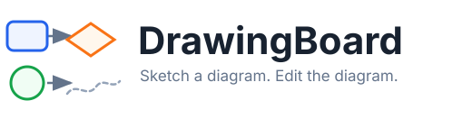
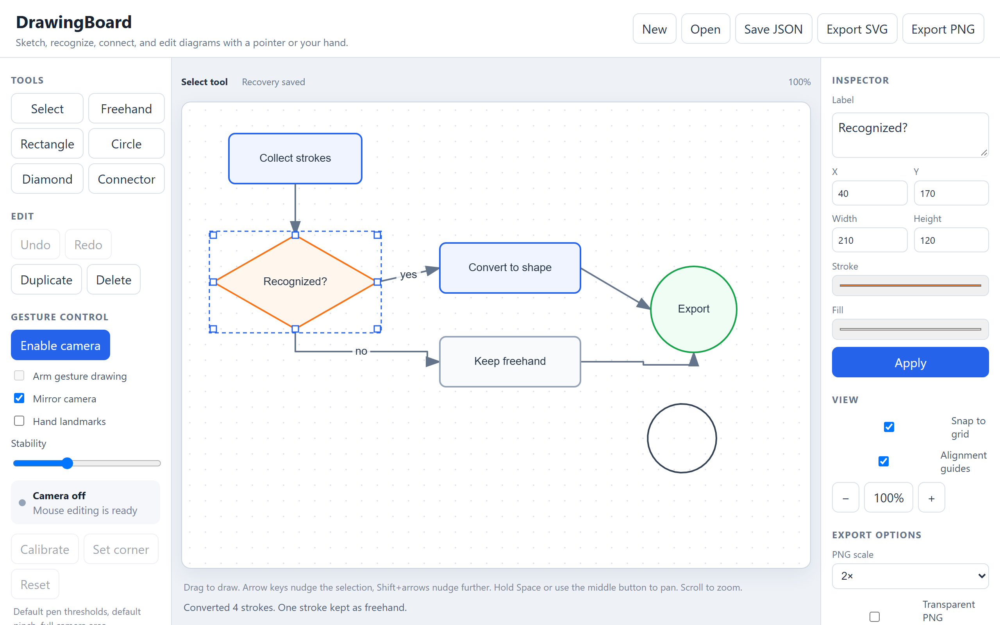

[](https://github.com/Coins99/DrawingBoard/actions/workflows/test.yml)
[](scripts/serve.mjs)

`DrawingBoard` is the easiest way to turn a rough sketch into an editable diagram.



Runs in any current browser with no build step. *Gesture input has not been verified against real camera hardware yet, so no frame-rate or latency figure is claimed. Mouse editing is fully tested.*

**Usage**
---

```
Usage: setup.cmd [OPTIONS]        (Windows)
       ./setup.sh [OPTIONS]       (macOS and Linux)

  Serve DrawingBoard and open it in your browser.
  Developed by Junran Zhou -> (Github: Coins99)


Options:
  --dev          Also install the development dependencies for the test suites.
  --port PORT    Serve on PORT instead of 4173.
  --no-open      Start the server without opening a browser.
  --help, -h     Show this message and exit.
```

Running the editor installs nothing. The setup script checks for Node.js, offers to install it if it is missing, and serves the page from the standard library. `--dev` is only needed to run the tests.

**Installation Options**
---

1. Run the setup script. This is the whole installation.
    + `$ git clone https://github.com/Coins99/DrawingBoard.git`
    + `$ cd DrawingBoard`
    + `$ .\setup.cmd` on Windows, or double-click `setup.cmd` in Explorer
    + `$ ./setup.sh` on macOS and Linux

2. Already have [Node.js](https://nodejs.org/en/download) 20.11 or newer?
    + `$ npm start`

3. No install at all, for mouse editing only.
    + Open `DrawingBoard/index.html` from disk.
    + Gesture input will not work: browsers block camera access on `file://`.

**Configuration Options**
---

1. Tools

    + Select, Freehand, Rectangle, Circle, Diamond, Connector
        - Keyboard shortcuts `V` `P` `R` `O` `D` `C`. Freehand strokes are offered as shapes; everything else draws directly.
    + Undo, Redo, Duplicate, Delete
        - `Ctrl`/`Cmd` + `Z`, `Shift` + `Ctrl`/`Cmd` + `Z`, `Ctrl`/`Cmd` + `D`, `Delete`.
    + Arrow keys nudge by 1 unit, `Shift` + arrows by 10
        - A run of nudges collapses into a single undo step.

2. View

    + Snap to grid?
        - Quantizes drags and resizes to a 10-unit grid.
    + Alignment guides?
        - Snaps a dragged shape to the edges and centres of its neighbours, and draws the line it matched.
    + Zoom and pan
        - Scroll to zoom about the pointer. Hold `Space` or use the middle button to pan. Neither changes stored geometry.

3. Export options

    + PNG scale, 1x or 2x
        - Output is capped at 16 million pixels and 8,192 pixels per side. Larger diagrams export at a reduced scale and the status line says so.
    + Transparent PNG background?
        - Off gives a white background. SVG export is always transparent.
    + Save JSON and Open
        - The versioned document format. Imports are validated, and a rejected file leaves the open diagram alone.

4. Gesture control

    + Enable camera
        - Nothing starts on its own, and disabling it releases the device.
    + Calibrate
        - Measures your own finger distances over four one-second prompts. If the touching and released distances overlap, the defaults are kept and the reason is shown.
    + Set corner
        - Records two opposite corners of the area you can comfortably reach. Leaving that area ends the stroke instead of sliding along the border.
    + Arm gesture drawing
        - Touch thumb to pinky once to ready the pen, move your index fingertip to draw, touch again to lift. In Select, dwell highlights and a pinch drags.
    + Stability
        - Trades pointer latency against jitter.

**Known Limits**
---

+ No run has happened against real camera hardware. There is no frame-rate, latency or false-activation figure, and [the manual camera checklist](docs/manual-camera-checklist.md) is still unperformed.
+ Recognition is measured only on synthetic fixtures from zero participants. That is a regression baseline, not a statement about real hands. See [the recognition evaluation](docs/recognition-evaluation.md).
+ Recognition covers circles, rectangles, diamonds and one arrow vocabulary. Triangles, other polygons and other arrow styles stay freehand; the connector tool is the fallback.
+ A rectangle rotated near 45 degrees is offered as a diamond, because its corners genuinely sit at the bounding-box extremes.
+ Connector waypoints cannot be edited by hand, and orthogonal routing does not avoid obstacles.
+ Gesture selection acts on one object at a time. Labels are always typed.
+ Local recovery is per browser and per origin. It is a crash net, not a backup: use **Save JSON** for anything you care about.

**How to Contribute**
---

1. Fork and clone the repository, then run `./setup.sh --dev` (or `.\setup.cmd --dev`) to install the test dependencies.

2. Make your change and keep the suites green: `npm test`, `npm run test:e2e` and `npm run evaluate`. A bug fix should come with the test that failed before it.

3. Open a pull request. If your change affects what the editor looks like, regenerate the demo image with `node scripts/screenshot.mjs`. [The architecture notes](docs/architecture.md) describe the module layout and the document format.

**Acknowledgements**
---

+ [MediaPipe Hands](https://github.com/google-ai-edge/mediapipe) for the hand landmark model, pinned to a tested version and loaded behind an adapter.
+ [Playwright](https://playwright.dev) for the browser tests, which replay landmark fixtures so gesture behaviour is checked without a camera.
+ [stronghold](https://github.com/alichtman/stronghold) by Aaron Lichtman, whose README this one is modelled on.

**Support**
---

DrawingBoard takes no donations. If it was useful, star the repository, or help with the one thing automated tests cannot do: run [the manual camera checklist](docs/manual-camera-checklist.md) on your own hardware and open an issue with the results and your device, browser, lighting and distance. Recorded strokes from a real hand are worth more here than any code contribution.
